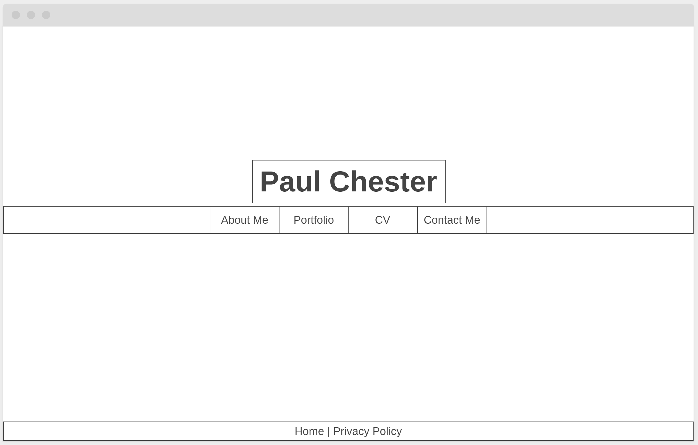
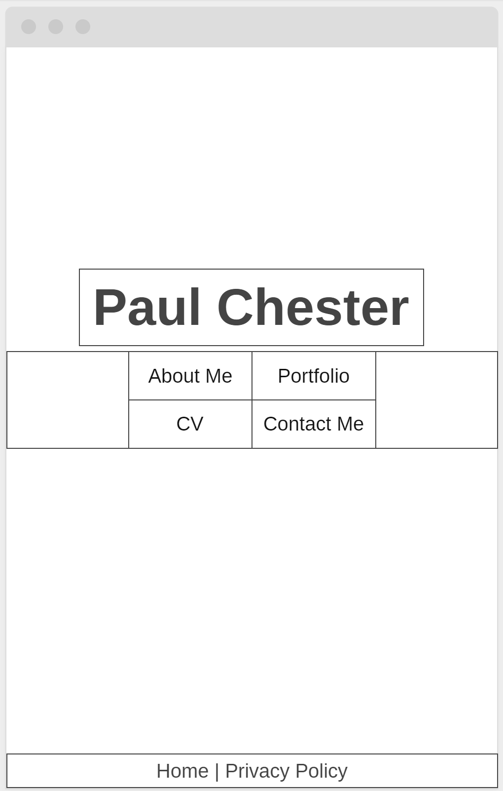
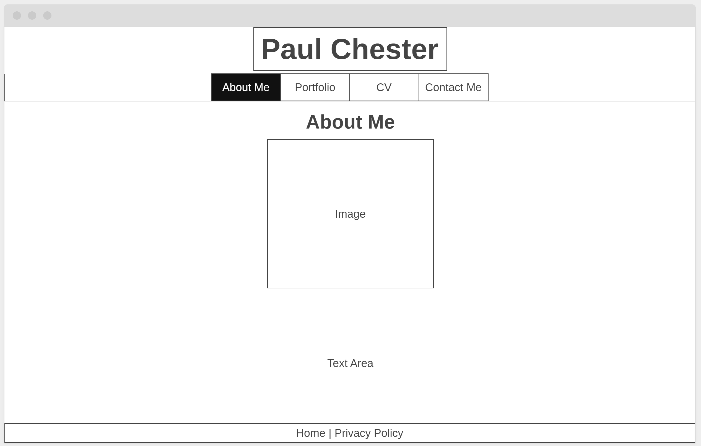
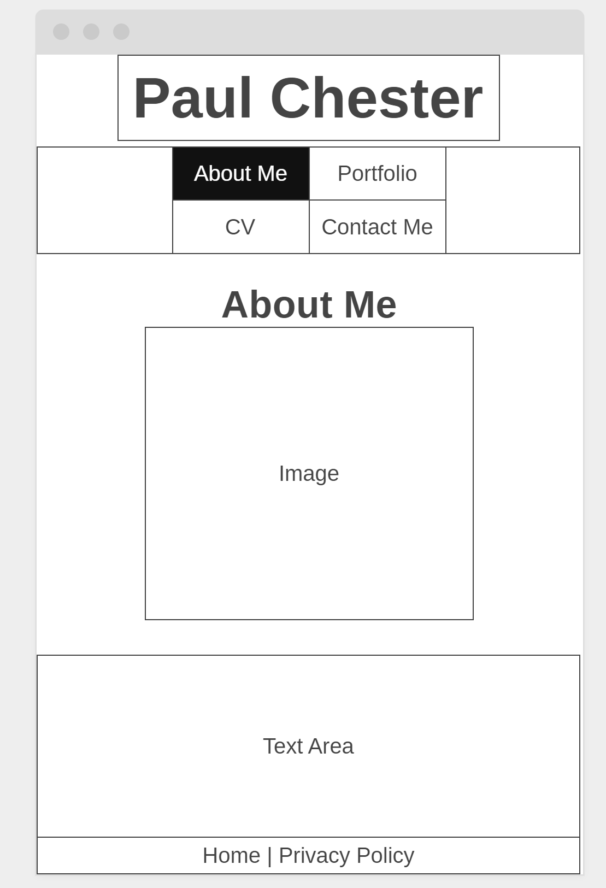
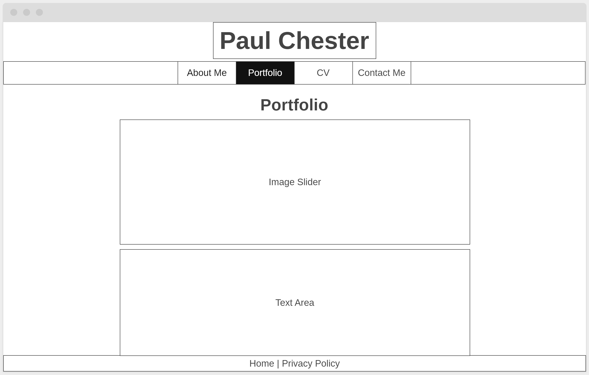
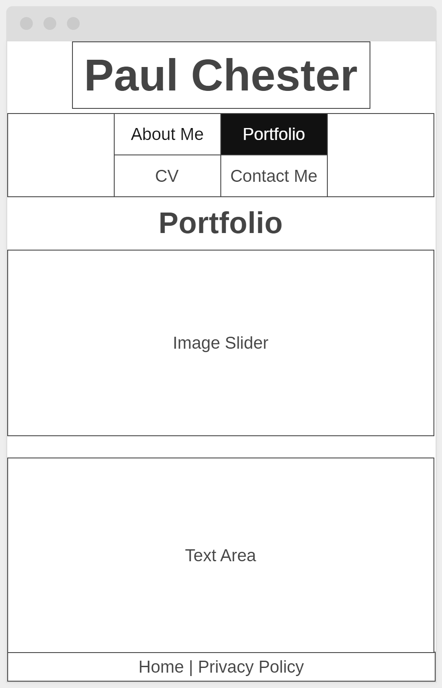
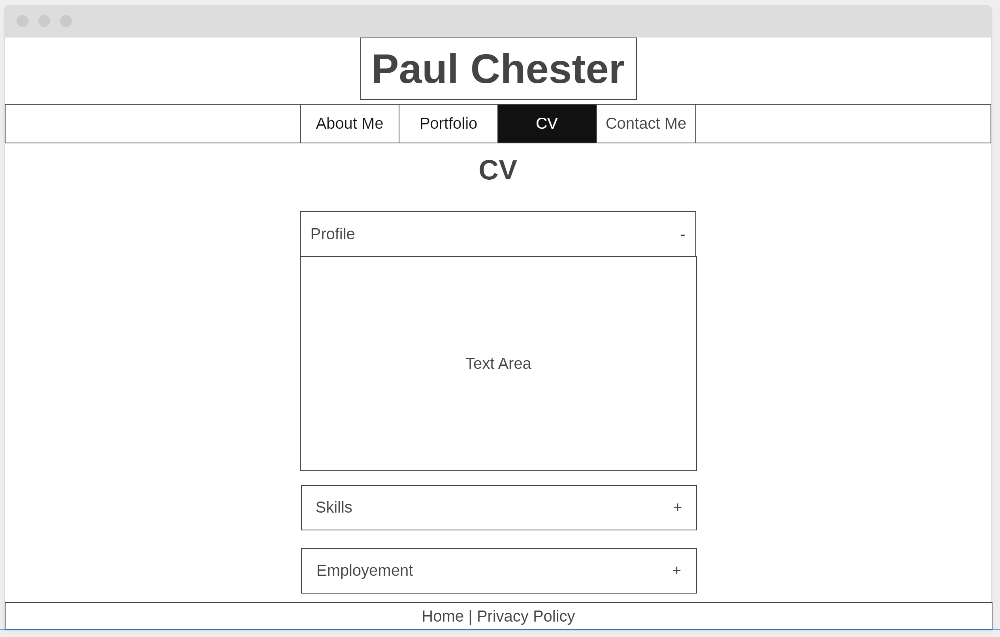
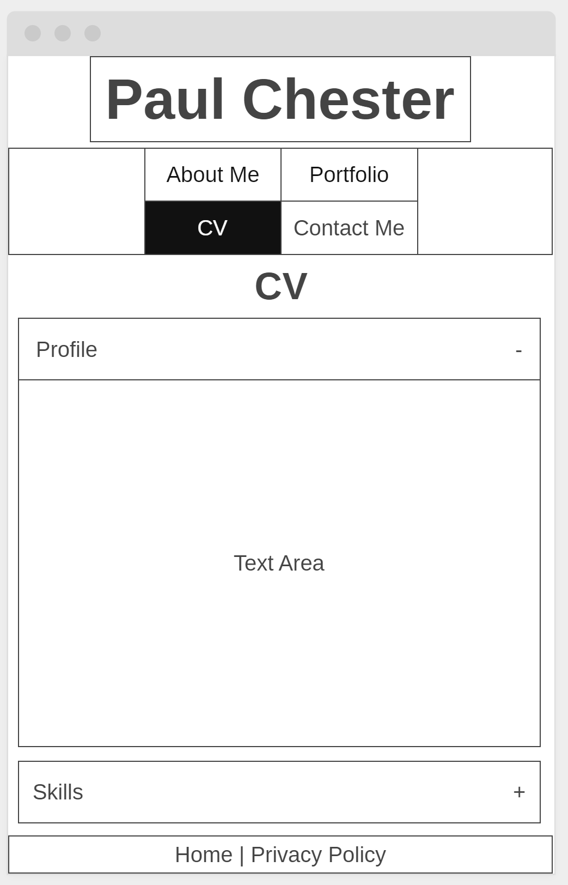
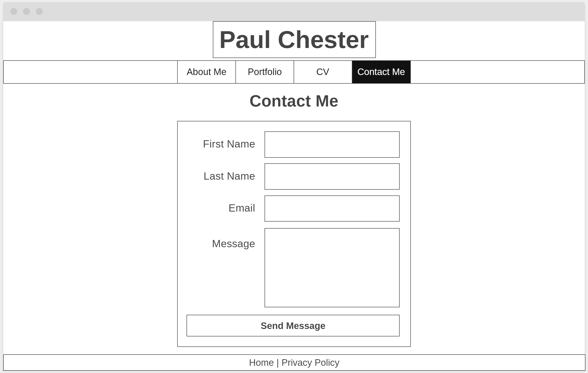
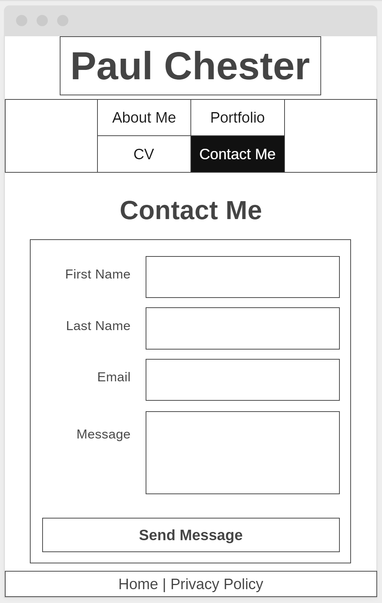

## Github URL

## Hosted at 

# Background
Due to the nature of the company I currently work at, I have chosen to create a personal website. The problem it is solving is that I don't currently have a self promotional website to advertise my CV. There is a need for this so in the future is any employers search for me they will be presented with my own website where my CV is stored, along with a way to contact me.

# Wire Frames
**index page wireframe**

**About Me page wireframe**

**Portfolio page wireframe**

**CV page wireframe**

**Contact Me page wireframe**

# Colour Choices
As it's a personal website I have decided on the colour scheme to be mainly greys. This is a neutral colour scheme and so will appear more formal. The colour has also been chosen partly because it is similar to the colours I have decorated my house with and is a colour I prefer.

# Accessibility
## Page title
All page titles are formed by the site name, followed by the page name. This makes them accessable as the web browser will display them in either the tab or the browser window. Other screen reading sofwatre will also be able to read the titles as they are in the head of the document.

## Images
All images on the website have alt text. This allows other software to read the pictures or if the image doesn't load it can be read what the image is of.

## Text
### Headings
Each page has it's own h1 heading. Other pages which include more headings have a meaningful hierarchy (CV page).
### Contrast ratio
The constrast ratio on the site is acceptable as text is readable on the light grey background. Where buttons change colour, the text also changes colour if needed to maintain readability.
### Resize Text
If text is re-sized the website will adjust to keep the correct look and avaoid text overlapping.
## Interaction
### Keyboard access as visual focus
The website has been tested and by using the tab key the correct fields are highlighted. This allows the entire website to be navigated without a mouse.
### Forms, labels, and errors
All forms use correct labels and inout types so keyboards can be used to control them.
## General
### Moving Flashing, or blinking Content
There is no moving, flashing or blinking content. apart from the animations on page transition and CV which last less than 5 seconds.
### Multimedia alternatives
No audo or video is used on the website.
### Basic structure check
The basic structure has been checked and is consistant throughout.

# GDPR
There are no cookies on the websites and the only part of the website which needs to conform to GDPR is the contact form. I have added a privacy policy in the footer of ever page which links to the privacy policy page which is a sifficent policy to cover the use of the data obtained in the contact form. There are no other opt-in forms on the website. 

# Distance Selling
The website doesn't sell any goods and as so the distance selling act does not apply.

# Evaluation

